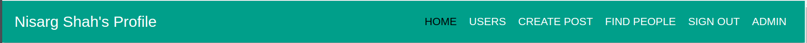
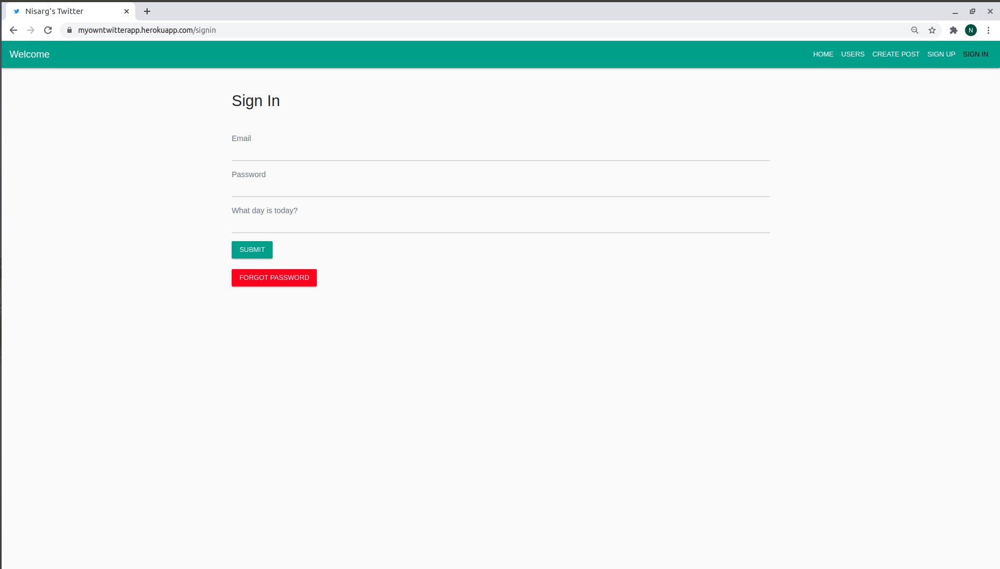
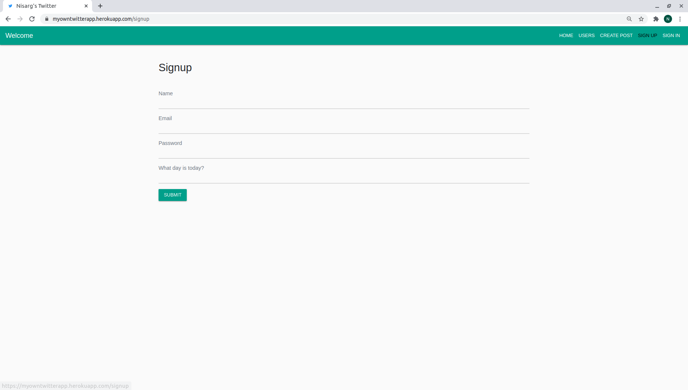
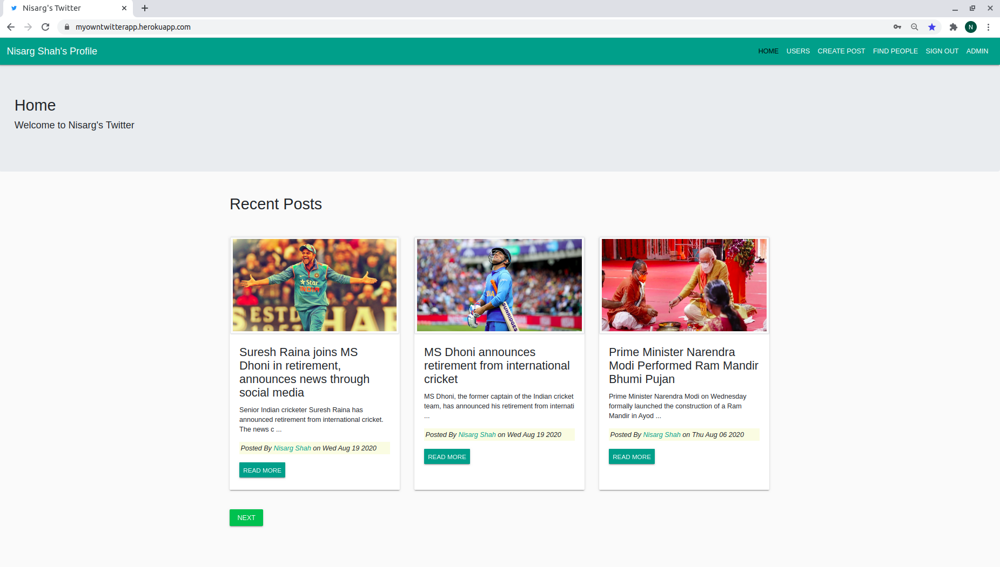
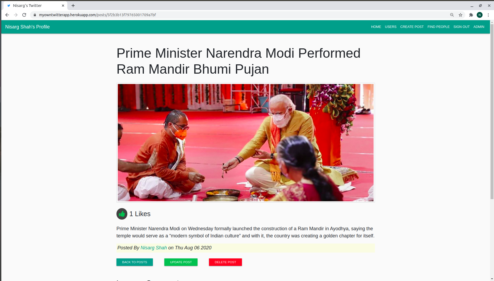
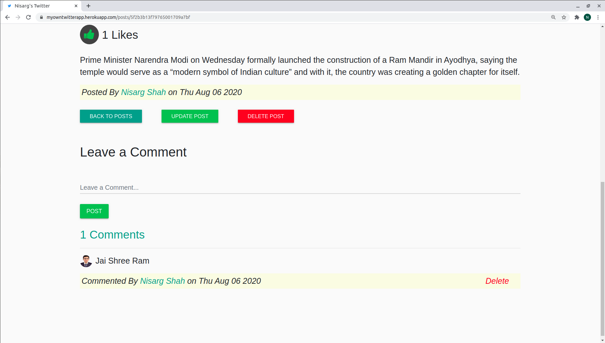
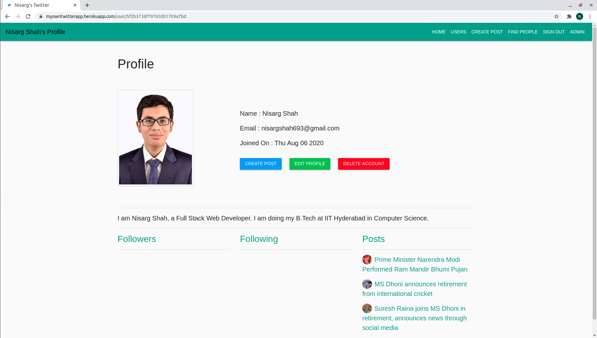
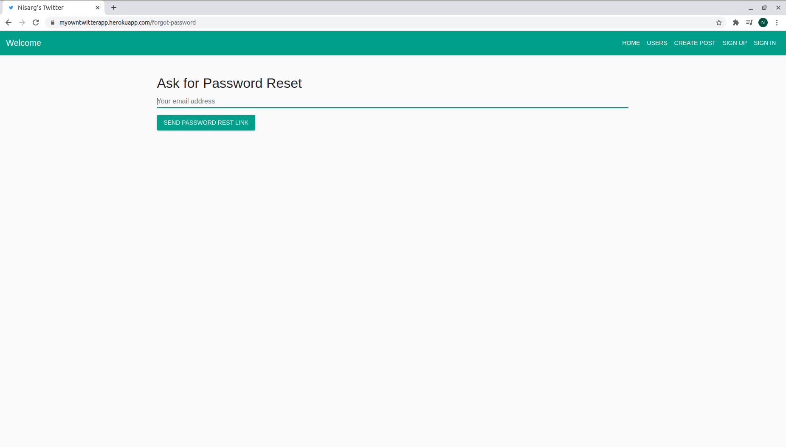

### Twitter Clone With Admin Dashboard

## To run this project, do the following :

### create .env file in React-Frontend Folder with the following code (update credentials).

```
REACT_APP_API_URL=http://localhost:8080
REACT_APP_GOOGLE_CLIENT_ID=xxxxxx.apps.googleusercontent.com
```
### create another .env file in Social Network Backend Folder with the following code (update credentials).

```
MONGO_URI=mongodb://localhost:27017/socialNetworkDB
JWT_SECRET=xxxxxx
CLIENT_URL=http://localhost:3000
REACT_APP_GOOGLE_CLIENT_ID=xxxxxx.apps.googleusercontent.com
EMAIL=xxxxx (smtp email)
PASSWORD=xxx (smtp password)
```

### Then run the following commands to start the App.

```
cd Social-Network-Backend/
npm i
node app.js
```
### Simultaneously run the following commands in another tab. Make sure you have create-react-app installed.

```
cd React-Frontend/
npm i
npm start
```

### Nav Bar (Admin is only visible if you are an admin)

<br />

### Sign In Page

<br />

### Sign Up Page

<br />

### Home Page

<br />

### On Clicking Read More

<br />

### Like and Comment

<br />

### View Profile

<br />

### Password Reset

<br />

